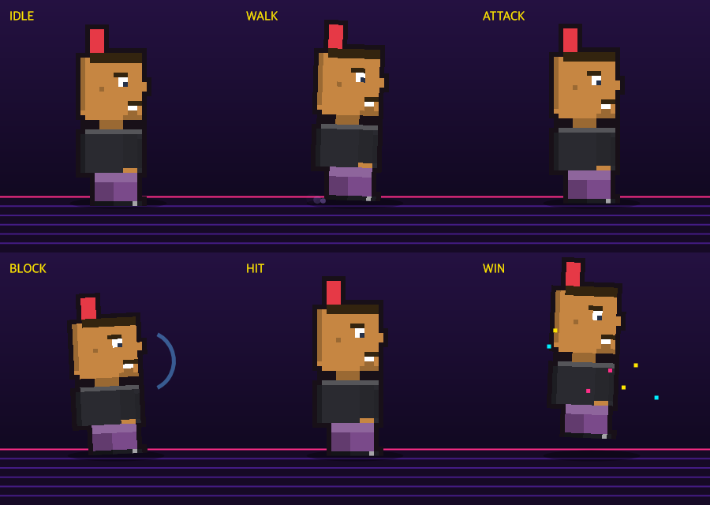

# retro-antlitz-kartei

Retro **pixel-art, full-body avatars** — generate, animate and edit them. Pick
parts and colours like [avataaars](https://getavataaars.com/) or
[DiceBear](https://www.dicebear.com/), or derive a deterministic avatar from a
seed string. Every avatar is a tiny 32×40 sprite **with legs**, drawn to canvas
and scaled with crisp nearest-neighbour pixels.

> Satire Edition: top hats, crowns, halos, hi-vis vests, lederhosen, monocles
> and a neon combat arena.

**▶ [Live editor demo](https://dracoblue.github.io/retro-antlitz-kartei/)** — deployed from `main` on every push.


<sub>Deterministic from a seed — `configFromSeed("Ada")`, `configFromSeed("Bjarne")`, …</sub>

| Three views | Combat poses |
| --- | --- |
|  |  |

## Packages

| Package | What it does |
| --- | --- |
| [`@retro-antlitz-kartei/generator`](packages/generator) | Framework-free core. Compose a sprite, render to canvas, encode/decode shareable codes, seed-based generation. |
| [`@retro-antlitz-kartei/animate`](packages/animate) | Combat-arena pose animation (idle, walk, attack, block, hit, win) over a generated sprite. |
| [`@retro-antlitz-kartei/react-editor`](packages/react-editor) | React `<AvatarEditor>` and `<AvatarPreview>` components — three retro themes, part cyclers, swatches, code box, seed input, combat modal. |

All packages are **MIT licensed** and ship ESM + CJS builds with type
definitions.

## Quick start

```bash
pnpm add @retro-antlitz-kartei/generator
```

```ts
import { configFromSeed, renderAvatar } from "@retro-antlitz-kartei/generator";

const canvas = document.querySelector("canvas")!;
renderAvatar(canvas, configFromSeed("Ada Lovelace"));
```

The same seed always produces the same avatar. Prefer hand-built configs? Use
`normalizeConfig`, `randomConfig`, or load a shared code with `decodeConfig`.

### React editor

```bash
pnpm add @retro-antlitz-kartei/react-editor react react-dom
```

```tsx
import { AvatarEditor } from "@retro-antlitz-kartei/react-editor";

export default () => <AvatarEditor seed="Ada" onChange={(cfg) => console.log(cfg)} />;
```

## Config & share codes

A config is a plain object of **string** part ids and **hex** colours — no
magic numbers. Adding or reordering a part option never breaks saved avatars,
share codes, or the drawing code (parts are dispatched by id, not index):

```json
{ "hat": "top-hat", "hair": "side-part", "ears": "normal", "nose": "button",
  "mouth": "smile", "top": "suit", "trousers": "suit-trousers",
  "build": "medium", "accessory": "none", "skin": "#e0ac69",
  "topColor": "#3a86ff", "background": "#3a86ff", "view": "front" }
```

Codes are base64 of exactly this object. `encodeConfig` / `decodeConfig`
round-trip it; invalid codes fall back to the default avatar instead of
throwing.

## Development

This is a [pnpm](https://pnpm.io) workspace.

```bash
pnpm install
pnpm build       # build every package
pnpm test        # run unit tests
pnpm typecheck   # type-check every package
node scripts/preview.mjs   # render sample PNGs to /tmp/rak-out (needs @napi-rs/canvas)
```

### Demo app

The editor demo under [`demo/`](demo) is a Vite app deployed to GitHub Pages by
the **Deploy demo to Pages** workflow on every push to `main` (enable
*Settings → Pages → Source: GitHub Actions* once).

```bash
pnpm build                                   # packages must be built first
pnpm --filter @retro-antlitz-kartei/demo dev # local dev server
```

**Experimental — describe your avatar (Chrome built-in AI):** the demo has a
"describe your avatar" bar that uses Chrome's on-device
[Prompt API](https://developer.chrome.com/docs/ai/prompt-api) (Gemini Nano) to
turn a text description into a config via structured output (a JSON schema built
from `PARTS`). You can also **drop or paste a photo** onto the field — the multimodal model is
asked one focused question per attribute (a single choice from that field's
allowed values, a few in parallel), which the small on-device model handles far
better than one big prompt. Colours are offered as names (blonde, navy, …) and
mapped back to palette hex. Chrome-only; enable
`chrome://flags/#prompt-api-for-gemini-nano` and let the model download. It lives
in the demo only — the published packages stay dependency-free.

## Releasing

Versioning and publishing are automated with
[changesets](https://github.com/changesets/changesets).

1. With each change, add a changeset describing it:
   ```bash
   pnpm changeset   # pick packages + bump type, write a summary
   ```
2. On `main`, the **Release** workflow opens (or updates) a **Version Packages**
   PR that applies the version bumps and changelogs.
3. Merging that PR publishes the bumped packages to npm.

The first push to `main` with no pending changesets publishes the current
`0.1.0` of each package directly. Continuous **alpha** prereleases are available
via `pnpm changeset pre enter alpha`.

Requires an `NPM_TOKEN` repository secret (an npm automation token with publish
rights to the `@retro-antlitz-kartei` scope).

CI (build · typecheck · test) runs on every push and PR.

## License

[MIT](LICENSE) © DracoBlue
